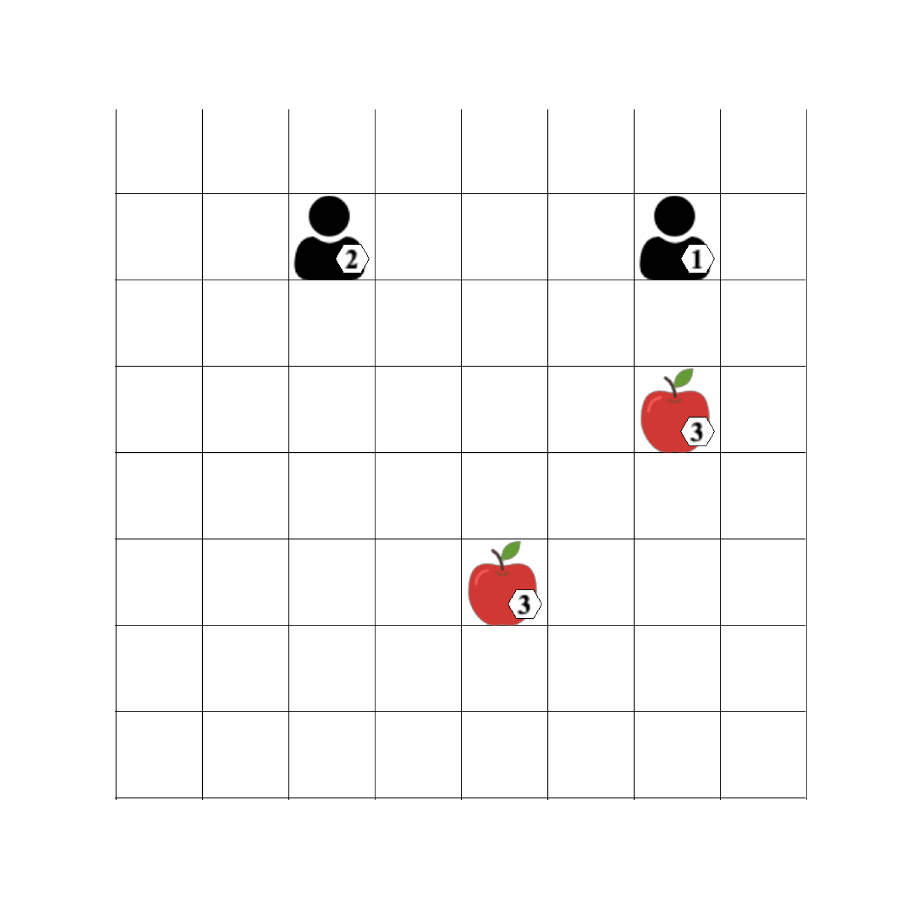

# Third Year Project Git Repository

Applicaiton of Q-learning to Level-based Foraging Environment 
 

  

<!-- TABLE OF CONTENTS -->
<h1> Table of Contents </h1>

- [Environments](#Environments)
- [Tabular Q-learning](#TAB)
- [Deep Q-learning](#DEEP)
- [Known Issues and Bugs](#BUG)

<!-- Environments-->
# Environments
This project implements three different Q-learning algorithms. The Environment for the tabular methods are Implemented by myself. However for deep RL methods, the [Level-based Foraging environment](https://github.com/semitable/lb-foraging) created by Filippos Christianos was used. 
 The environment is provided under MIT [License](./LICENSE).It is recommended to first install the environment from the link provided above, and then test the algorithms seperately. It is recommended to clone the enviroment git repository in a python virtual environment with python version 3.7 or older. Then this git can be cloned executed. The [requirements](/requirements.txt) file provide the required python modules. 

<!-- TAB-->
# Tabular Q-learning 
The [Single Agent case](./IMPLEMENTATIONS/Tabular.py) and the [multi agent case](./MPLEMENTATIONS/Tabular_multi.py) both store the action values in a python dictionary object, with states acting as keys. For the single agent case each state has a list of 4 action values. In the multi agent case each state has a list of 16 action values, as a joint policy is implemented. The [util](/IMPLEMENTATIONS/util.py) file provides the code for ploting the results. 

<!-- DEEP-->
# Deep Q-learning
The neural networks and deep learning techniques are implemented using [pytorch](https://pytorch.org). The pytorch website provides details for easy installation and usage documentation.

The [naive approach](./IMPLEMENTATIONS/Naive_deep_Q_learning.py) implements a very similar algorithm to the tabular case, however two seperate neural networks are used to represent the Q functions for each agent, and the update target is then used to compute the gradient to optimise the nueral network. However this approach does not converge. However its still included as a stepping stone. 

The [DQN agent](/IMPLEMENTATIONS/DQN_agent.py)  fixes the convergence issues by implementing a replay buffer and a target network for each agent. The [ENV_AGENT](/IMPLEMENTATIONS/ENV_AGENT.pyIMPLEMENTATIONS) files defines the Linear deep network class and the replay buffer class for improved readability. The raw results received from the environment are stored in a CSV file. 

To change the environment to a forced_coop settings, the authors recommend declaring a new environment as described in their [documentation](https://github.com/semitable/lb-foraging), however this can also be done by explicitely changing the forced_coop boolean value in the environment source code. The [DQN agent with reward shaping](/IMPLEMENTATIONS/DQN_forced_coop.py) is able to successfully learn how to act in under the forced cooperation contraint. 

<!-- BUG-->
# Known Issues 
1. The requirements file neeeds to be updated to remove unecessary requirements. 
