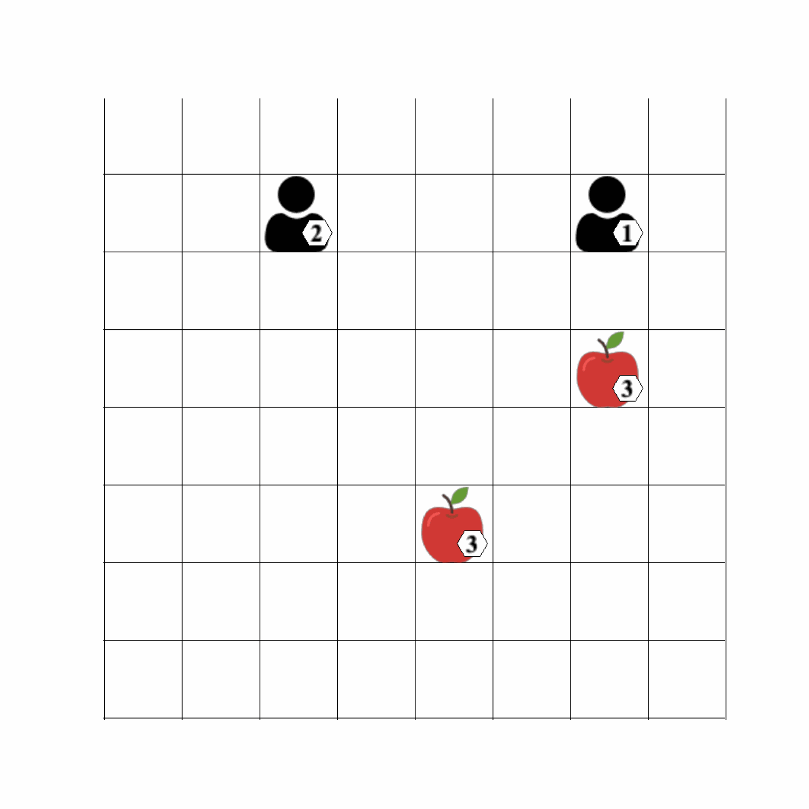
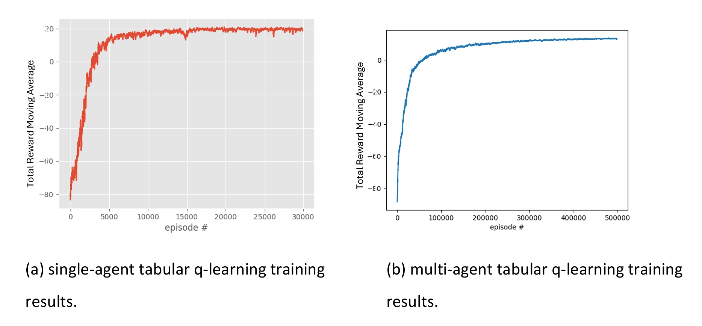
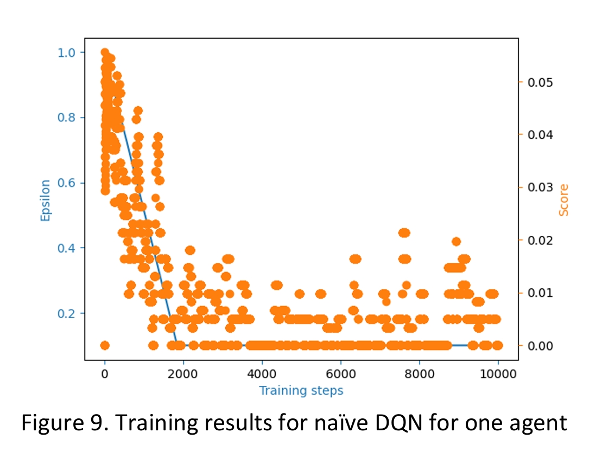
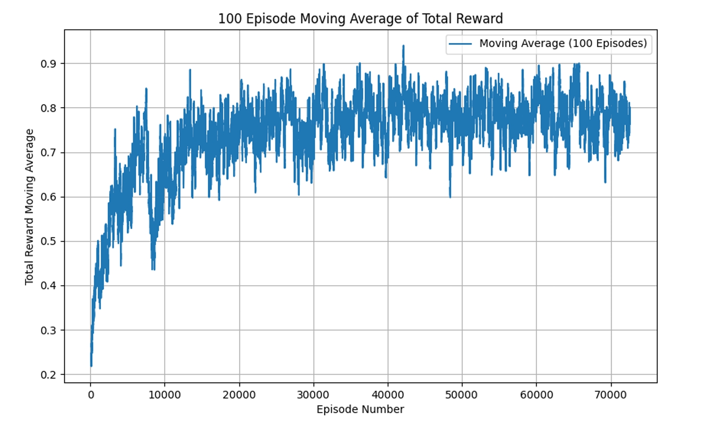
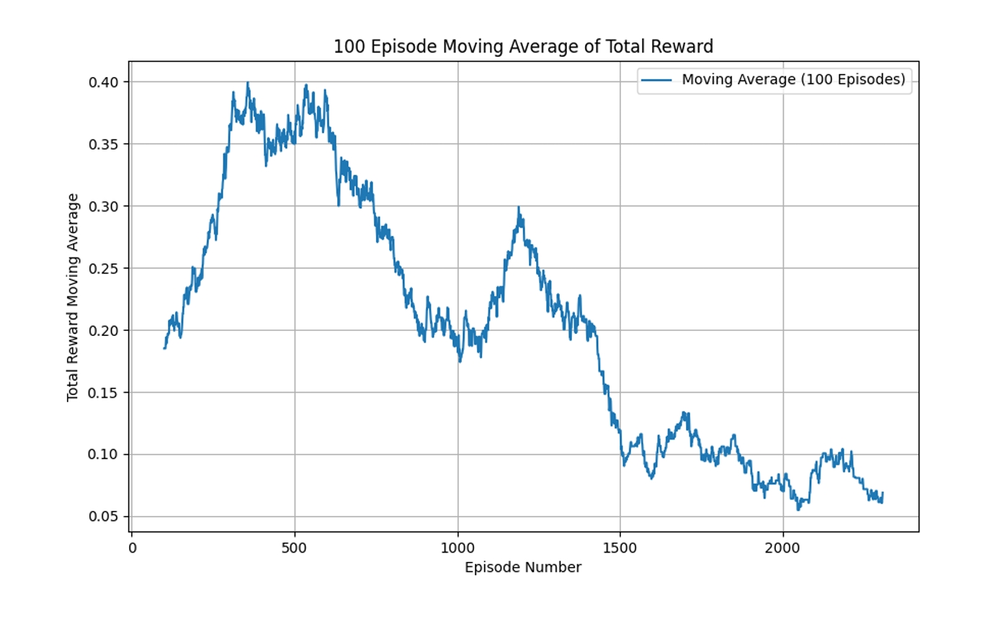
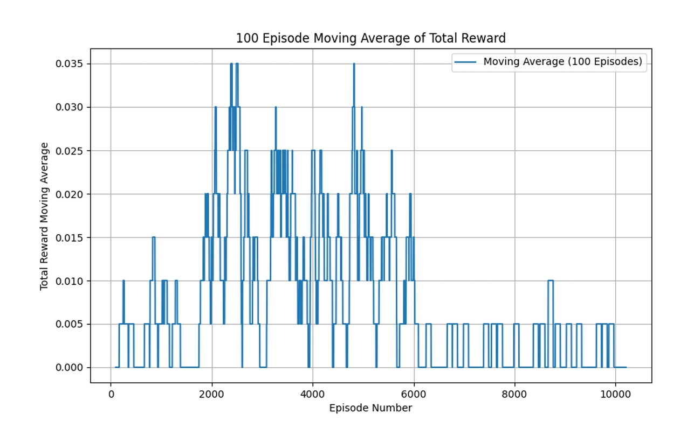
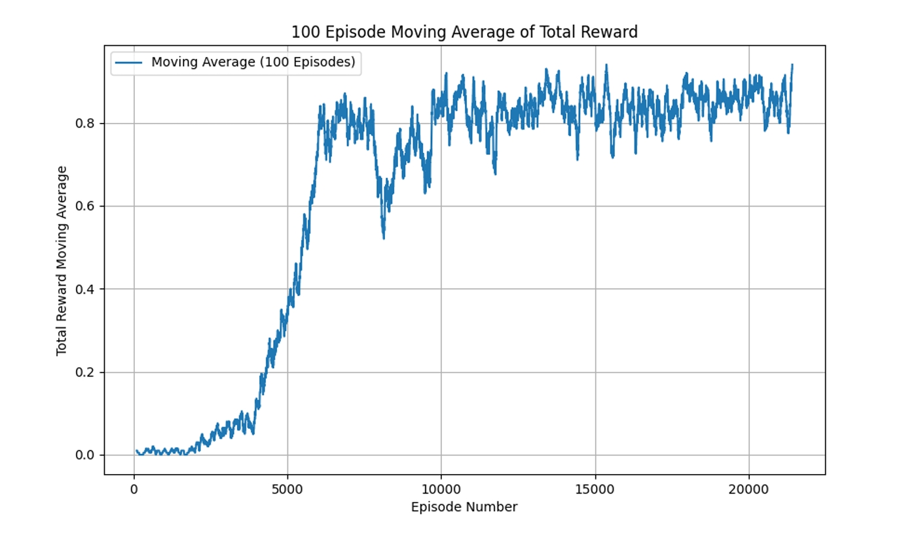
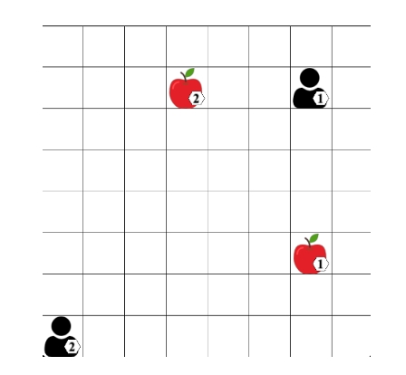

# Multi-Agent Reinforcement Learning on Level-Based Foraging

> A final-year project exploring tabular Q-learning and Deep Q-Networks (DQN)
> in cooperative multi-agent grid-worlds, with a focus on non-stationarity,
> scalability limits, replay buffers, target networks, and reward shaping.

<p align="center">
  
</p>

<p align="center">
  
  
  
</p>

---

## Project Status

This repository is a portfolio-ready reconstruction of my third-year individual
project. The original work was completed as a dissertation-style research
project; this cleaned version keeps the results and algorithms intact while
making the code easier to inspect, run, and review.

The repository now separates reusable learning components from experiment
entrypoints, writes new outputs under `runs/`, and includes smoke tests for fast
validation. The figures below are historical evidence from the original project,
not newly regenerated benchmark claims.

Full report: [`reports/MARL_PROJECT.pdf`](reports/MARL_PROJECT.pdf)

---

## What This Project Shows

The project compares:

- **Tabular Q-learning**
  - Single-agent baseline in a small custom grid-world
  - Multi-agent joint-action Q-learning in a simplified setting
- **Deep Q-learning**
  - Naive independent DQN
  - DQN with target networks and experience replay
  - Forced-cooperation DQN with reward shaping

The main environment is **Level-Based Foraging (LBF)**, where agents must
coordinate their positions and levels to collect food items.

---

## Key Results

### 1. Tabular Q-learning works until the state/action space grows

- Single-agent tabular learning is effective in a small grid.
- Multi-agent joint-action tabular learning can work in simplified settings,
  but the Q-table grows quickly as states and joint actions expand.

<p align="center">
  
</p>

### 2. Naive independent DQN is unstable

The straightforward "replace the Q-table with a neural network" approach fails
to converge reliably because each agent is learning while the other agent's
policy is changing.

<p align="center">
  
</p>

### 3. Target networks and replay buffers stabilize DQN

Adding classic DQN stabilizers improves learning in the mixed-cooperative LBF
setting.

<p align="center">
  
</p>

The experiments also showed high sensitivity to learning rate.

<p align="center">
  
</p>

### 4. Forced cooperation needs additional structure

When agents must cooperate every time, sparse rewards make independent DQN
struggle without communication or shaping:

<p align="center">
  
</p>

Reward shaping can make learning possible, but the result is heuristic and less
robust than a more principled cooperative MARL method.

<p align="center">
  
</p>

---

## Environment: Level-Based Foraging

LBF is a grid-world with `n` agents and `m` items, each with a level. Agents can
collect an item only if they stand adjacent to it and the sum of cooperating
agent levels is greater than or equal to the item level.

This environment is a useful abstraction for distributed robotics tasks, such
as multiple robots coordinating to pick, carry, or complete missions.

<p align="center">
  
</p>

---

## Repository Structure

- `marl_lbf/` - cleaned Python package with agents, replay buffer, reward
  shaping, environment helpers, and runnable entrypoints
- `tests/` - focused unit tests and smoke tests
- `assets/` - historical figures and demo GIF used in this README
- `docs/` - reproducibility notes and third-party notices
- `reports/` - final project report PDF

---

## Quickstart

For smoke-mode validation, only `numpy` is required for tabular training and
`pytest` is required for tests. DQN training requires PyTorch.

```bash
python -m venv .venv
source .venv/bin/activate
pip install -r requirements-dev.txt
python -m pytest
```

On Windows PowerShell, activate the environment with:

```powershell
.\.venv\Scripts\Activate.ps1
```

For the full historical experiment stack, use a Python 3.7 environment and
install the pinned project dependencies:

```bash
pip install -r requirements.txt
```

Run quick smoke checks:

```bash
python -m marl_lbf.train_tabular --episodes 10 --smoke
python -m marl_lbf.train_dqn --episodes 10 --smoke
python -m marl_lbf.train_forced_coop --episodes 10 --smoke
```

Run against LBF after installing full dependencies:

```bash
python -m marl_lbf.train_tabular --episodes 500
python -m marl_lbf.train_dqn --episodes 500
python -m marl_lbf.train_forced_coop --episodes 500
```

All new metrics and checkpoints are written to `runs/` unless `--output-dir` is
provided.

---

## Engineering Notes

- Checkpoint loading is opt-in through `--load-checkpoint`; the runners do not
  depend on missing local `.pt` files or Q-tables.
- The code intentionally keeps the algorithms simple and close to the original
  dissertation implementation, rather than replacing them with a modern MARL
  framework.
- See [`docs/REPRODUCIBILITY.md`](docs/REPRODUCIBILITY.md) for environment
  constraints, expected runtime, and limitations.
